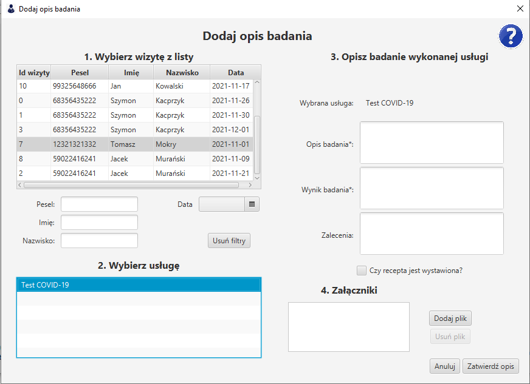

# Dodaj opis badania

Panel dodaj opis badania pozwala lekarzom na dodanie opisu oraz zaleceń dotyczących konkretnej uslugi w konkretnej wizycie, którą prowadził.

Z listy należy wybrac wizytę - można ją wyszukać poprzez filtry: `pesel` , `imię`, `nazwisko` lub `datę`.

Nastepnie po załadowaniu usług na danej wizycie należy wybrać odpowiednią.

Uzupełnić formularz zawierający obowiązkowe pola takie jak: `opis badania`, `wynik badania`.
Pola opcjonalne to: `zalecenia`, checkbox `czy recepta została wystawiona?` oraz lista załączników

Zdjęcia można dodawać naciskając przycisk `Dodaj plik` a następnie wybrać zdjęcie zapisane na komputerze. Jeśli popełniono błąd, można je zaznaczyć z listy i usunąć przyciskiem 'Usuń plik'

> Po uzupełnieniu danych, które są potrzebne należy nacisnąć przycisk `Zatwierdź opis`. Program zapyta czy dodać opis jeśli, któreś z opcjonalnych pól nie zostało uzupełnione.

*Zdjęcie poglądowe* 
