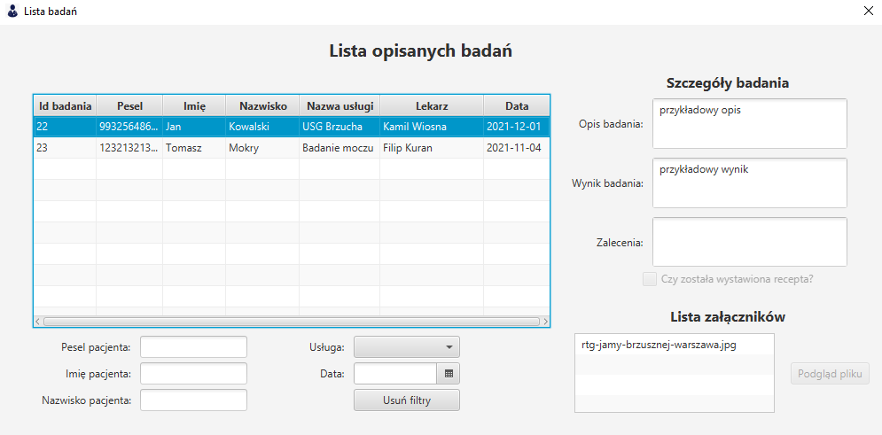

# Lista opisanych

Panel lista opisanych wizyt pokazuje konkretne opisy wraz z załącznikami, które można otworzyć. (Lekarz widzi tylko swoje opisy). 

Dane można filtrować za pomocą następujących filtrów: `pesel pacjenta`, `imię pacjenta`, `nazwisko pacjenta`, `usługa`, `data`.

Filtry można zresetować naciskając przycisk `Usuń filtry`.

*Zdjęcie poglądowe*
