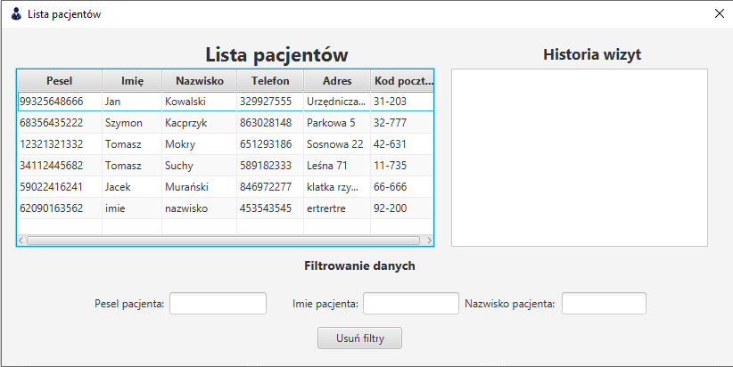

# Lista pacjentów

Panel pokazuje listę pacjentów wraz z informacjami o nich oraz o historii wizyt.

Dane można filtrować za pomocą następujących filtrów: `pesel pacjenta`, `imię pacjenta`, `nazwisko pacjenta`, 

##### Program wyświetli nam takie informacje jak:
Pesel pacjenta  
Imię i nazwisko pacjenta  
Telefon kontaktowy  
Adres pacjenta 
Kod pocztowy pacjenta 
Historię wizyt wraz z datami 

Filtry można zresetować naciskając przycisk `Usuń filtry`.

*Zdjęcie poglądowe* 
