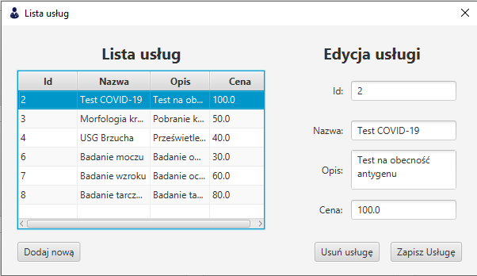

# Lista usług

Panel pokazuje listę usług jakie oferuje przychodnia.

Istnieje możliwość edycji usługi, usunięcie usługi oraz dodanie nowej usługi.

Pola wymagane to: `nazwa`, `opis` oraz `cena` (format zmiennoprzecinkowy).

*Zdjęcie poglądowe* 
