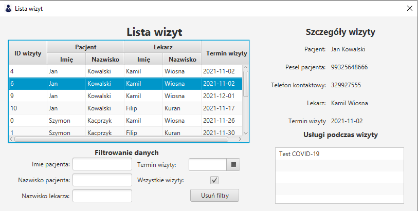

# Lista wizyt

Panel listy wizyt pokazuje przeszłe oraz przyszłe wizyty wszystkich pacjentów, którzy zostali na nie umówieni. (Lekarz widzi tylko te wizyty, które prowadził).

Dane można filtrować za pomocą następujących filtrów: `imię pacjenta`, `nazwisko pacjenta`, `nazwisko lekarza`, `termin wizyty` oraz checkboxa `wszystkie wizyty` (odznaczając go ukrywamy stare wizyty).

##### Program wyświetli nam takie informacje wizyty jak:
Imię i nazwisko pacjenta  
Pesel pacjenta  
Telefon kontaktowy  
Imię i nazwisko lekarza 
Termin wizyty 
Listę usług podczas wizyty 

Filtry można zresetować naciskając przycisk `Usuń filtry`.

*Zdjęcie poglądowe* 

