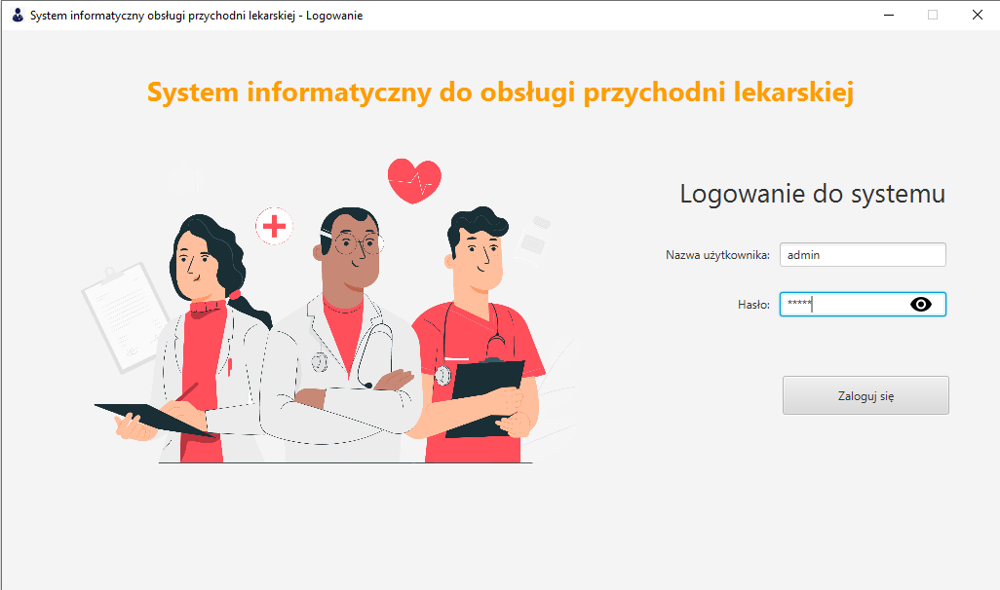

# Logowanie

Logowanie do systemu na konkretne konto które posiada konkretne [uprawienia](/uprawienia).

> Loginy oraz hasła do poszczególnych testowych kont: 

| Login | Hasło | Uprawienia |
| --- | --- | --- |
| rejestrator | rejestrator | Rejestrator |
| lekarz | lekarz | Lekarz |
| lekarz1 | lekarz1 | Lekarz |
| kierownik | kierownik | Kierownik |
| admin | admin | Administrator |

> Wpisane hasło można podejrzeć klikając ikonę oka w polu `hasło`

*Zdjęcie poglądowe* 
