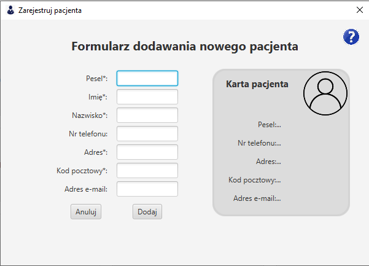

# Rejestracja pacjenta

Rejestracja pacjenta zawiera formularz, dzięki któremu można dodać nowego pacjenta do bazy. 

#### Wymagane pola:
> Pesel - 11 cyfrowy  
> Imię  
> Nazwisko  
> Adres  
> Kod pocztowy - w formacie XX-XXX (gdzie X to dowolna cyfra) 

#### Opcjonalne pola:
> Numer telefonu - 9 cyfrowy  
> Adres email - w formacie nazwakonta@domena.pl 

*Zdjęcie poglądowe* 
