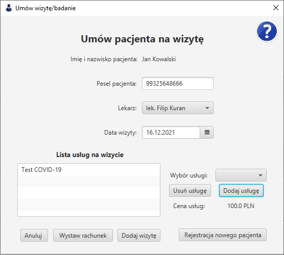

# Umów wizytę/badanie

Umów wizytę/badanie zawiera formularz, dzięki któremu można umówić konkretnego pacjenta do konkretnego lekarza na konkretne usługi.

Po wpisaniu pierwszych cyfr numeru Pesel, program automatycznie podpowie nam imię oraz nazwisko pacjenta. Wciśnięcie entera w polu `pesel pacjenta` automatycznie go uzupełni.

Z listy lekarzy należy wybrać osobę do której zapisuje się pacjenta.

Z kalendarza należy wybrać datę planowanej wizyty.

Z listy `wybór uslugi` należy wybrać usługę/usługi, które mają znaleźć się na wizycie. Można je dowolnie usuwać z listy dodanych klikając na nią a następnie na przycisk `usuń usługę`. Program automatycznie podlicza koszt wizyty.

#### Wymagane pola:
> Pesel pacjenta - 11 cyfrowy  
> Lekarz  
> Data wizyty  
> Usługi - minimum jedna  

Z tego miejsca można również wygenerować rachunek za wizytę w formacie PDF klikając przycisk 'Wystaw rachunek' a następnie wybierając miejsce jego zapisu.

*Zdjęcie poglądowe* 

