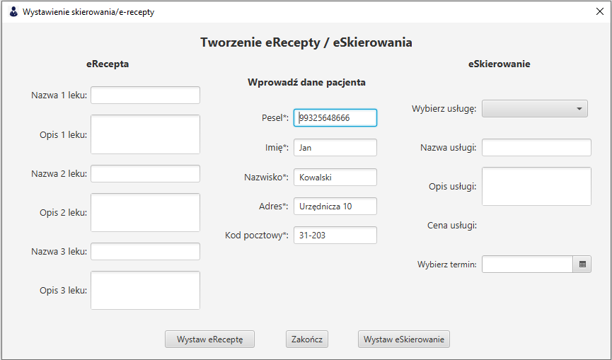

# Wystaw e skierowanie/receptę

Panel wystaw e skierowanie/receptę pozwala na wystawienie skierowania/recepty dla konkretnego pacjenta. Dane zapisywane są w formacie PDF.

#### Wymagane dane dla eSkierowania lub eRecepty:
Pesel pacjenta - należy wpisać początek a program sam podpowie dane pacjenta. Należy nacisnąc enter aby pesel uzupełnił się automatycznie.

##### Wymagane dane dla eSkierowania:
> Usługa wybrana z listy  
> Termin 

*Po wybraniu usługi - jej dane uzupełnią się automatycznie.*

##### Wymagane dane dla eRecepty:
> Nazwa 1 leku  
> Opis 1 leku 
Pozostałe dla 2 i 3 leku są opcjonalne.

> Po uzupełnieniu danych, które są potrzebne należy odpowienio wybrać `Wystaw eReceptę` lub `Wystaw eSkierowanie` a następnie wybrać miejsce zapisu.

*Zdjęcie poglądowe* 
